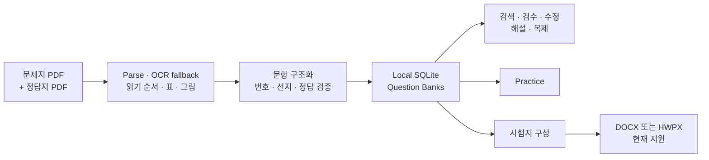

<div align="center">

# Exam Generator

### 기출문서를 문제은행으로, 문제은행을 편집 가능한 시험지로.

**A local-first Windows workspace for parsing exam documents, reviewing structured questions, building reusable question banks, practising locally, and exporting editable exams.**


[빠른 시작](#빠른-시작) · [주요 기능](#주요-기능) · [출력 형식](#출력-형식) · [데이터 경계](#데이터-경계) · [기술 문서](#기술-문서)

</div>

---

> **Parse exam documents. Build trusted question banks. Export editable exams.**

공개 시험 PDF는 바로 재사용할 수 있는 데이터가 아닙니다. 문제지와 정답지는 서로 다른 레이아웃을 쓰고, 오래된 문서는 글자 순서가 깨지며, 표·그림·공통 지문·밑줄·수식·OCR 오류가 한 문항 안에 섞여 있습니다.

**Exam Generator**는 이 불완전한 문서를 구조화된 로컬 문제은행으로 바꾸고, 사람이 검수·수정·풀이한 뒤 새로운 시험지로 다시 내보낼 수 있도록 만든 데스크톱 애플리케이션입니다.

## 한눈에 보는 흐름



## 주요 기능

| 영역 | 현재 제공하는 기능 |
|---|---|
| **PDF 가져오기** | 문제지·정답지 parsing, 좌표 기반 읽기 순서 복원, OCR fallback, 이미지·표·밑줄·윗줄 처리 |
| **문항 구조화** | 문항 번호, 본문, 선지, 과목, 정답, 공통 지문, 서술형 모범답안 및 서식 metadata 관리 |
| **문제은행 관리** | 검색, 필터, 검증, 수정, 사용자 문항 추가, 기존 문항 복제, 해설 작성, 안전한 삭제 |
| **문제 풀이** | 연결된 문제은행에서 조건별 문항을 선택해 로컬 모의고사 구성 및 채점 |
| **시험지 내보내기** | 단일·다중 시험 과목 조합, 묶음 문항 유지, 선지 섞기, 표·이미지·정답표를 포함한 DOCX 또는 HWPX 생성 |
| **문제은행 연결** | SQLite DB 및 이미지 포함 `.examdb.zip` package 가져오기·내보내기, 여러 domain DB mount |
| **로컬 통합** | 사용자별 Codex side panel, 휴대 가능한 설정, 로컬 데이터와 인증정보 분리 |

## 왜 Exam Generator인가

### 문서를 저장하는 데서 끝나지 않습니다

원본 PDF를 검색 가능한 텍스트로 바꾸는 것만으로는 문제은행이 되지 않습니다. 문항과 선지를 올바르게 분리하고, 정답을 정확히 연결하며, 표와 그림이 어느 문항에 속하는지 보존해야 합니다.

### 불확실성을 숨기지 않습니다

문서 생성 방식과 OCR 품질에 따라 Parser 결과는 달라질 수 있습니다. 가져온 문항은 validation 결과와 함께 검수하는 것을 전제로 하며, 운영 데이터는 원본과 비교 가능한 상태로 유지해야 합니다.

### 데이터는 사용자의 컴퓨터에 남습니다

기본 workflow는 로컬 SQLite와 로컬 파일을 사용합니다. 실제 문제은행, 개인 인증, OCR cache, 생성 문서는 source repository와 분리됩니다.

## 출력 형식

### DOCX — 현재 지원

현재 릴리스는 편집 가능한 Word 시험지를 생성합니다.

- A4 및 2단 시험지 layout
- 과목별 section
- 공통 지문과 묶음 문항
- 4~10개 객관식 선지와 서술형
- 문제·선지 이미지
- 단순 표의 native table 출력과 복잡한 표의 image fallback
- 선지 순서 섞기와 정답 재계산
- 선택형 정답표

### HWPX — 현재 지원

시험지 내보내기 화면에서 `출력 형식`으로 HWPX를 선택하면 같은 `ExamDocument`를 direct OWPML compiler로 저장합니다. 복잡한 표·수식은 경고와 함께 보이는 대체 출력을 사용합니다. HWP 바이너리 출력, HWPX 가져오기, 문항 추출은 지원하지 않습니다.

- 설계 및 acceptance gate: **[HWPX Export Roadmap](docs/roadmap/hwpx-export.md)**
- 목표: 사용자가 `.docx` 또는 `.hwpx`를 선택해 같은 시험 내용을 편집 가능한 문서로 저장
- 원칙: 지원하지 않는 표·수식·도형은 조용히 누락하지 않고 명시적 fallback과 warning 제공

## Exam Packs

Exam Generator는 로컬 DB와 `.examdb.zip` package를 연결할 수 있습니다. 장기적으로 공개 배포 가능한 문제은행은 application source와 분리된 versioned **Exam Pack**으로 제공하는 구조를 목표로 합니다.

```text
exam-generator          application · parser · schema · validators
exam-generator-packs    catalog · manifests · provenance · release assets
exam-generator-mcp      optional read-only access layer after pack stabilization
```

상세한 package, rights, release, rollback 및 MCP 경계는 **[Exam Pack Distribution Roadmap](docs/roadmap/exam-packs.md)**에 정리되어 있습니다.

## 빠른 시작

### Python 환경에서 실행

```powershell
python -m venv .venv
.\.venv\Scripts\python.exe -m pip install --upgrade pip
.\.venv\Scripts\python.exe -m pip install -r requirements.txt
.\.venv\Scripts\python.exe -m src.gui.main
```

### 저장소 launcher 사용

```text
Run_Latest_App.bat
```

패키징된 실행본을 직접 만들고 실행하려면:

```text
Build_And_Run_Packaged_App.bat
```

비개발자를 위한 두 실행 경로는 [README_APP_RUN.txt](README_APP_RUN.txt)에 설명되어 있습니다.

## 테스트

전체 test suite:

```powershell
.\.venv\Scripts\python.exe -m pytest -q
```

Parser 중심 검증:

```powershell
.\.venv\Scripts\python.exe -m pytest -q `
  tests\test_parser_2025.py `
  tests\test_text_cleanup.py `
  tests\test_comcbt_pdf.py `
  tests\test_offline_exam_parser.py
```

브랜드·메뉴·launcher contract는 pull request의 Windows workflow에서도 검증합니다.

## 저장소 구조

```text
src/
  cli/                 CLI entry points
  database/            SQLite schema, migrations, repositories, validation
  exporter/            DOCX exporter and shared table layout
  gui/                 PyQt desktop application
  parser/              PDF extraction, OCR, layout, questions, answers, quality
  quiz/                Mock-exam generation and practice
  utils/               Shared helpers
  web_import/          Public web/PDF import pipelines

scripts/               Import, repair, audit, packaging, and data-prep tools
experiments/           DB mount and domain-split prototypes
tests/                 Unit, regression, GUI, repository, and export tests
docs/                  Architecture, plans, references, and roadmaps
chapter_cards/         Exam-driven teaching-material planning cards
source_notes/          Source and reference notes
```

## 데이터 경계

이 repository의 목적은 application code와 재현 가능한 contracts를 보존하는 것입니다. 다음 항목은 기본적으로 Git에 포함하지 않습니다.

- 운영 문제은행과 개인 DB backup
- `data/` runtime state
- 개인 Codex 인증정보
- OCR cache와 임시 추출물
- logs, generated DOCX/HWPX/PDF, build 결과, virtual environment

새 checkout은 빈 SQLite schema를 초기화해 앱을 실행할 수 있습니다. 실제 운영 데이터는 로컬에서 공급하거나 사용자가 명시적으로 연결해야 합니다.

현재 history에 존재하는 `.examdb.zip` artifact는 분류와 migration이 끝나기 전까지 transitional 상태로 취급합니다. 검증·backup·rights classification 없이 자동 삭제하거나 별도 저장소로 이동하지 않습니다.

## 현재 상태

- **제품명:** Exam Generator
- **Repository:** `CAPTW/exam-generator`
- **Repository rename:** 2026-08-26 완료; 이전 `CAPTW/exam-weaver-archive` URL은 새 저장소로 redirect
- **Desktop:** Windows-first PyQt application
- **Current editable export:** DOCX, HWPX
- **Not supported:** HWP binary export, HWPX import, HWPX-to-question parsing
- **Storage:** local SQLite and mountable Exam DB packages
- **Parser:** source-specific quality varies; human review remains authoritative

## 기술 문서

- **[Full technical reference](README.technical.2026-08-25.md)** — 기존 상세 architecture, parser, DB schema, screens, CLI, packaging reference
- **[HWPX Export Roadmap](docs/roadmap/hwpx-export.md)** — format-neutral export model과 HWPX acceptance gates
- **[Exam Pack Distribution Roadmap](docs/roadmap/exam-packs.md)** — 데이터 repository 분리, manifest, release, rights 및 MCP boundary
- **[Repository Rename Record](docs/roadmap/repository-rebrand.md)** — repository rename 검증, 호환성 및 후속 조치
- **[DB Mount Prototype](experiments/db_mount_prototype/README.md)** — domain DB mount와 이동 prototype

## 라이선스와 출처 권리

Repository code와 저작자가 직접 만든 bundled material은 [MIT License](LICENSE)를 따릅니다. 시험 문서, 가져온 데이터베이스, 교재, 이미지 및 제3자 자료의 권리는 각 원저작자와 배포 조건에 남아 있습니다.

코드 라이선스가 데이터 재배포 권한을 자동으로 부여하지 않습니다. 공개 Exam Pack은 별도의 provenance와 rights classification을 통과한 자료만 대상으로 합니다.
