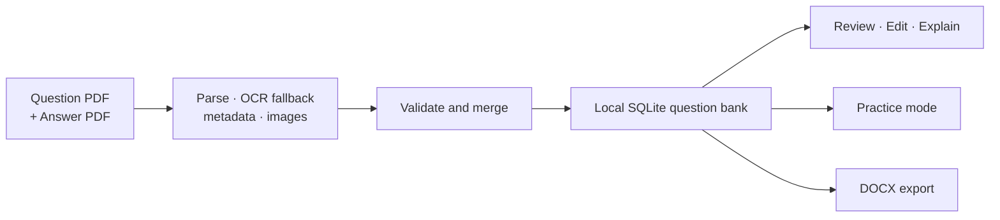

<!-- BRAND_REFRESH_2026_08_25 -->
<div align="center">

# 🧵 Exam Weaver Archive

### From messy exam PDFs to a living question bank.

**A Windows-first workspace for parsing public exam documents, reviewing structured questions, practicing locally, and exporting editable exam sheets — without publishing the production database.**


[Quick start](#quick-start) · [What is included](#what-you-get) · [Data boundary](#data-boundary) · [Full technical reference](README.technical.2026-08-25.md)

</div>

---

> **The codebase is shareable. The question bank is not.**

`exam-weaver-archive` preserves the application, parser, database contracts, import utilities, tests, packaging scripts, and Codex side-panel integration behind a local exam-question workflow. Operational databases, credentials, OCR caches, and generated outputs stay outside Git.

## Why this exists

Public exam material is rarely machine-ready. Question sheets, answer sheets, OCR artifacts, tables, grouped passages, images, and historical formatting all have to become one consistent local data model before anyone can search, edit, practise, or export them.

This repository handles that translation layer.

## What you get

| Surface | What it does |
|---|---|
| **PDF ingestion** | Parses question and answer documents, recovers reading order, attaches images, and validates numbering and answer mappings. |
| **Question-bank desktop app** | Browse, filter, validate, edit, clone, explain, and delete structured questions. |
| **Practice + export** | Generate mock exams and export editable DOCX exam sheets with passages, images, answer keys, and basic notation. |
| **Local integrations** | SQLite persistence, database mount/package experiments, import recovery, and a user-authenticated Codex side panel. |

## How it flows



## Quick start

```powershell
python -m venv .venv
.\.venv\Scripts\python.exe -m pip install --upgrade pip
.\.venv\Scripts\python.exe -m pip install -r requirements.txt
.\.venv\Scripts\python.exe -m src.gui.main
```

Or use the repository launcher:

```text
Run_Latest_App.bat
```

Run the test suite:

```powershell
.\.venv\Scripts\python.exe -m pytest -q
```

## Data boundary

This archive intentionally excludes:

- production question-bank databases and backups;
- `data/` runtime state and personal Codex authentication;
- OCR caches, extracted images, logs, temporary files, and generated documents;
- virtual environments, executables, and build artifacts.

A fresh checkout can initialize an empty local SQLite schema. Real operational data must be supplied locally.

## Status

This is an **application-code archive**, not a bundled content release. Parser behavior varies with source quality, document generation method, and OCR conditions; validation output should be reviewed before imported records are treated as authoritative.

## Full technical reference

The pre-refresh detailed README — including parser internals, database schema, screen-by-screen behavior, CLI examples, packaging notes, and Korean documentation — is preserved unchanged at:

**[README.technical.2026-08-25.md](README.technical.2026-08-25.md)**

## License and source rights

Repository code and bundled author-created materials follow the license files and notices in this repository. Exam documents, imported databases, and third-party source material retain their original rights and are not redistributed by this archive.
